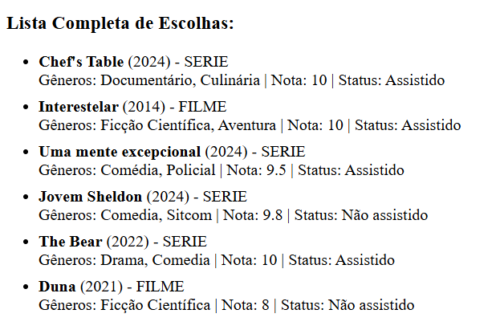
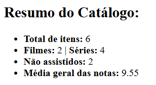
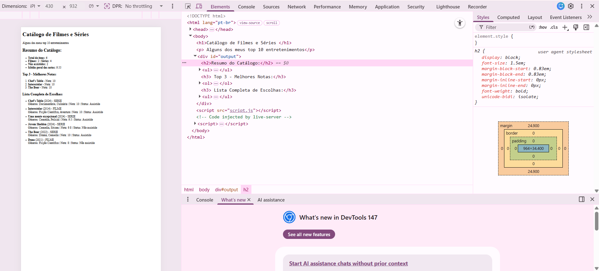

# Trabalho Prático - Semana 8
Nesta atividade, você irá fazer exercícios de programação com o objetivo de praticar a manipulação de objetos e arrays em JavaScript, passando pela definição de dados em notação JSON (JavaScript Object Notation), acessando propriedades e itens, e usando iterators para processar os dados e gerar resultados.
## Informações Gerais

- Nome: Maria Luiza Sousa Montaño
- Matrícula: 925569

## Print da aplicação

### Listagem de títulos

### Cálculo de médias

### Resumo de verificações (some e every)

### Página com o resumo

